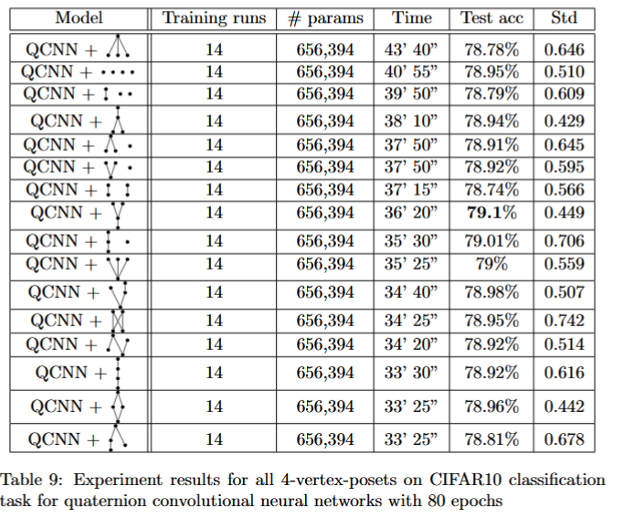

# Poset-filters
<p align="center"><a href="https://arxiv.org/abs/2412.06097"></a>

This reposity contains the code of the paper "Order Theory in the Context of Machine Learning: an Application"
## Contents


* **Overview**
  - Poset-filters are a family of convolutional filters, sometimes they produce better accuracy than average pooling, max pooling or mix pooling.

    
 
* **Example Usage**: 
For the poset N:
```python
from poset_utils import filter_n 
#on the init section of the NN
self.poset_pool = filter_n

#on the forward section of the NN
out= self.poset_pool(out)
```
   
For another poset (for example the number 12):
```python
from poset_utils import PosetFilter,  dict_posets
#on the init section of the NN
self.poset_pool = PosetFilter(coeffs=dict_posets[12])

#on the forward section of the NN
out= self.poset_pool(out)
```
The index of the poset is the row in the following table, starting from 0 (the slowest) to 15 (the fastest):

  

1 corresponds to the disjoint union of points/cube.

13 corresponds to the four chain/simplex.


* **Test**
To run the PyTorch test run
```bash
 python -m unittest  test/test.py

```
The tests for **forward propagation** use the `poset_utils.py` file.

The tests for **backpropagation steps** use the `debugging/_poset_utils.py` file (internal dictionary modified).


* **Getting Started**
  - Clone this repo:
```bash 
    git clone https://github.com/mendozacortesgroup/Poset-filters.git

    cd Poset_filters
```    
    install prerequisites in a virtual environment.


  - prerequisites

    python >=3.7

    pytorch >= 2.2.0

  - location of:
    - code: [poset_filters PyTorch](poset_utils.py)
    - issue tracker : [report issues](https://github.com/mendozacortesgroup/Poset-filters/issues)


* **Notes**
  - version : v1.0
  - If the input has odd dimentions, the code automatically adds padding one on the right and/or bottom.
  - The combination ReLU followed by a poset filter seems to work well.
  - The seeds used in experiments were:

  If the experiment was repeated 14 times:   

```python
import torch
import numpy as np
import random

for seed in  [2, 315, 568, 6664, 32168, 35156, 351646, 789465, 798648, 4861351, 8465864, 9876568, 6567979, 83115846]:
    torch.manual_seed(seed)
    np.random.seed(seed)
    random.seed(seed)
    torch.backends.cudnn.deterministic = True
    torch.backends.cudnn.benchmark = False
    def seed_worker(worker_id):
        worker_seed = torch.initial_seed() % 2**32
        np.random.seed(worker_seed)
        random.seed(worker_seed)
    g = torch.Generator()
    g.manual_seed(seed)
    #if cuda:
    torch.cuda.manual_seed(seed)
    trainLoader = DataLoader(
        dset.Somedataset(root='data', train=True, download = True,
        transform=trainTransform),
        batch_size=batchSz, shuffle=True, worker_init_fn=seed_worker, generator=g,  **kwargs) #Note the seed_worker and generator
    testLoader = DataLoader(
        dset.Somedataset(root='data', train=False, download = True,
        transform=testTransform),
        batch_size=batchSz, shuffle=False, worker_init_fn=seed_worker, generator=g, **kwargs)
```
  If the experiment was not repeated 14 times (example cross val), the seed value was 2 in the previous code.


* **Colophon**
  - Credits -- code, algorithm, implementation/deployment, testing and overall direction: Eric Dolores Cuenca, Aldo Guzman-Saenz and Susana Lopez Moreno. Principal Investigator: Sangil Kim and Jose L. Mendoza-Cortes.  
  - Copyright and License -- see [LICENSE](https://github.com/mendozacortesgroup/Poset-filters/tree/main?tab=MIT-1-ov-file#readme) file.
  - How to contribute: submit issues.
  - This project has received funding from the National Research Foundation of Korea (NRF) grant funded by the Korea government (MSIT) (2022R1A5A1033624, 2021R1A2B5B03087097).
  - This work was supported in part through computational resources and services provided by the Institute for Cyber-Enabled Research at Michigan State University
  - References:  https://arxiv.org/abs/2412.06097
  
* **Citation**
If you use this code for your research, please cite our paper:

```
@misc{poset_filters,
  title={Order Theory in the Context of Machine Learning: an application}, 
      author={Eric Dolores-Cuenca and Aldo Guzman-Saenz and Sangil Kim and Susana Lopez-Moreno and Jose Mendoza-Cortes},
      year={2024},
      eprint={2412.06097},
      archivePrefix={arXiv},
      primaryClass={cs.CV},
      url={https://arxiv.org/abs/2412.06097}, 
}
```
